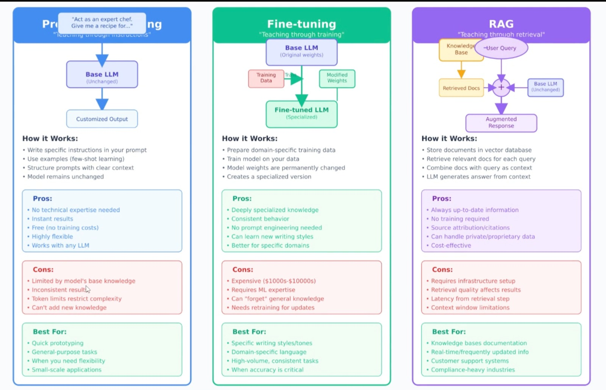

# AI Chatbot Architecture Notes

## ReAct Architecture

**ReAct** = Reasoning + Action (tool use)


---

## Retrieval-Augmented Generation (RAG)

### What is RAG?

RAG lets an LLM use external information (documents, databases, wikis, APIs) retrieved at query time to produce more accurate answers.



### RAG vs Alternatives

| Approach | Description | Pros | Cons |
|----------|-------------|------|------|
| **Prompt Engineering** | Simple prompts; no external data | Fast and simple | Limited knowledge |
| **Fine-tuning** | Train on domain data | Good for style/skills | Not suitable for fresh facts |
| **RAG** | On-demand external knowledge | Up-to-date, explainable sources | More complex setup |

### Core Components

- **Retrieval**: Fetch relevant information from a source (database, API, website)
- **Augmentation**: Enrich retrieved content with metadata (e.g., source, created date)
- **Generation**: Use the retrieved context to generate the final answer


---

## RAG Workflow Phases

RAG workflow consists of three main phases:

1. **Document Ingestion**
2. **Query Processing**
3. **Generation Phase**

### Document Ingestion and Preprocessing Phase (Pre-step)

This is the preparation phase where domain data is prepared for efficient retrieval:

- **Preprocessing**: Load the data, clean, chunk into small pieces, embed, and store as vectors
- **Storage**: Store domain data in a vector database for efficient similarity search
- **Query-time**: A retriever finds the most relevant chunks; the LLM generates an answer using search techniques (similarity search, cosine similarity, etc.)


#### Document Ingestion Steps

1. **Load the Data**: 
    - Import documents from various sources 
    - From any data source (text, word, database, excel file) convert it to Documents type
    - From `langchain_core.documents import Document`
    - Document type will have metadata and page_content

2. **Splitting Text**: 
    Divide documents into manageable chunks (using different techniques: Character, Recursive, Token).
    Splitting keeps chunks small, semantically meaningful, and efficient for both embedding and retrieval. In RAG, document splitting isn't optional — it's foundational.
    You split text to ensure:

    - You stay under model token limits
    - You improve retrieval accuracy
    - You minimize cost
    - You maintain semantic integrity
    
    **Main splitting techniques:**
    1. **Character Splitter**: Split by fixed character count
    2. **Recursive Splitter**: Split by hierarchy (paragraphs → sentences → words)
    3. **Token Text Splitter**: Split based on token count for the target model
    4. **Semantic Text Splitting**: Best approach based on meaning
    
3. **Embedding Model**: 
    - An embedding is a numerical representation of data — typically a vector (a list of numbers) — that captures the meaning or characteristics of that data in a way that machines can process.
    - An embedding model is a machine learning model trained to convert input data (like text, images, or audio) into these high-dimensional numerical vectors. (embedding models will have 100+ dimensions)
    - An embedding model takes raw input (like text, an image, or even audio) and converts it into a dense numerical vector — a list of numbers that represents the meaning or essence of that input.
    - Traditional keyword search only matches exact words. Embeddings allow understanding the meanings.

    **Real-World Use Cases:**
    - **Semantic Search**: Query: "How to reset my router?" - System finds documents with similar embeddings instead of keyword matches.
    - **Chatbots & QA**: Retrieve contextually relevant information based on embedding similarity.
    - **Recommendation Systems**: Suggest similar movies/products based on vector similarity.
    - **Anomaly Detection**: Identify outliers in embedding spaces and convert text chunks into vector representations.
    
    In the code example, I used `sentence-transformers/all-MiniLM-L6-v2` model which uses 384 dimensions, but if you want more accuracy, use models with more dimensions.

    See the example code for this.

4. **Storage: Vector Database**: 
    Store embeddings in a vector database.

    **Vector Store:**
    Lightweight. You can keep vectors in local memory, files, or simple tools like ChromaDB or FAISS.

    **Vector Database:**
    A full database built for vectors. Examples include Pinecone, Milvus, Weaviate, Qdrant. It handles indexing, scaling, filtering, persistence.

---

### Query Processing Phase

When a user searches for something:

1. **Convert to Vector**: The input text is converted into a vector representation
2. **Compare**: Compare with stored vectors in the database using search techniques
3. **Retrieve**: Find the most relevant information chunks
4. **Enrich**: Append retrieved content with useful metadata (source, relevance score, etc.)


### Searching Techniques 

#### Similarity Search

After storing the data in the vector database, we use similarity search by default (in `simple_rag.py`).

#### Hybrid Searching Techniques

There is a more advanced technique called hybrid search, which combines dense retrieval (similarity-based) and sparse retrieval (based on word occurrences). We can choose based on weightage (ex: 50-50).

**Sparse Retrieval:**
- Matches exact words using techniques such as TF-IDF, BM25
- Helpful in some cases (like keywords, special words in the doc)

**Dense Retrieval:**
- Uses embeddings for semantic similarity search

#### LLM-Based Ranking

This is another search technique: after retrieving top-k results, we can give them to LLM for ranking.

#### MMR Retrieval (Maximal Marginal Relevance Retrieval)

It's a reranking strategy used in RAG to get results that are: 
- Relevant to the query, AND 
- Not duplicates of each other (high diversity)

In short, it helps to remove redundant documents (repeated docs). It prevents the common issue: "Vector store returns 5 almost-identical chunks."

**MMR retrieval:**
- 👉 A smarter reranker that reduces redundancy
- 👉 Balances relevance + diversity
- 👉 Supported by LangChain via `search_type="mmr"`

---

### Query Enhancement

Instead of giving user query directly to the retriever, there are ways to enhance the user query before proceeding with searching with vectors (similarity search with vector DB).

**Workflow:**
```
user query => [LLM + prompt] => better query => retriever
```

#### Query Expansion Technique

Expands the user query by adding relevant synonyms, related terms, entities, or keywords so the retriever can match more documents.

**Example:** "kidney pain" → "renal pain, nephrology, kidney inflammation, flank pain"

#### Query Decomposition Technique

Breaks a complex query into smaller, simpler sub-queries and retrieves for each part separately. Each sub-query will make an LLM call, get all the LLM outputs, and combine them into a single answer.

#### HyDE Technique (Hypothetical Document Embeddings)

The LLM hallucinates (generates) a hypothetical document based on the user's query, and that synthetic document is embedded for retrieval instead of the raw query.

**How it works:**
- The LLM generates a hypothetical answer document to the user query
- That synthetic document is embedded for retrieval instead of the raw query
- This helps improve retrieval accuracy by matching on the expected answer structure

**Implementation:**
We can implement our own logic or use LangChain's `HypotheticalDocumentRetriever`.

---

### Generation Phase

The original query + retrieved relevant information will be sent to the LLM, which will generate the final output based on the combined context.

---

## Handling Different Types of Documents (Image, Audio, Video)

### What is OCR? (Optical Character Recognition)

OCR = Technology that extracts text **from** an image or PDF. OCR does **NOT** understand layout, meaning, or context. It only converts pixels → characters.

**Example:**
- You upload an invoice → OCR reads the text
- Output = plain text only: "Invoice No: 123, Amount: $450"

**Limitations:**
- Only extracts text characters
- No understanding of document structure or context
- Requires separate processing for meaning

### Multimodal RAG

Multimodal RAG = RAG that works with text + images + diagrams + tables.

**How it works:**
- You send the raw image directly to a multimodal model (like GPT-4o, Gemini, Claude Vision)
- The model "understands" the image (text, layout, objects, charts)
- It retrieves relevant info and generates responses
- No need for separate OCR

**Best for:**
- Documents with visual elements
- Dashboards and reports
- Forms and invoices
- Charts and diagrams
- Complex layouts with text and images

**Advantages over OCR:**
- Understands context and meaning
- Can interpret layout and structure
- Handles visual elements (charts, diagrams)
- More accurate than simple text extraction
    

-----
-----

# LANG GRAPH

refer: AIAgentWithrag.ipynb

Node - simple python methods
Edges - connect nodes ()
State  - state, which can shared between nodes
State Graph -> graph of the entrie wrokflow


## Memory Saver
    Langgraph use a check pointer to automatically sae the graph state after each step. 

    # to make the memory across the sessions need (memory = MemorySaver())
    memory = MemorySaver()
    graph = graph_builder.compile(memory)

## Streaming
    graph state chagnes/output can streamed. there are two methods astream and stream and two params(values and updates)
    
    ### stream
    graph.stream({"messages": ""}, stream_mode="updates")
    graph.stream({"messages": ""}, stream_mode="values")

    ##  astream - maninly used for debugging purpose
        graph.astream_events