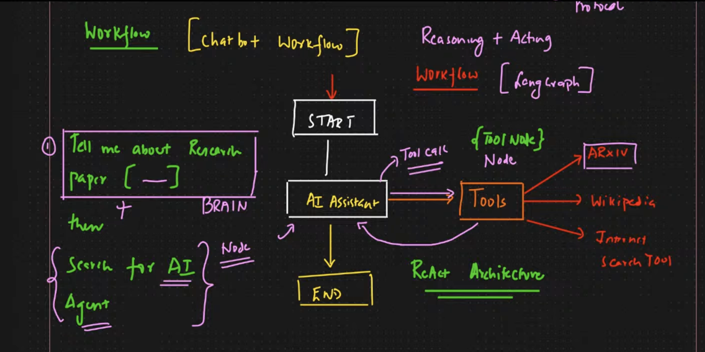
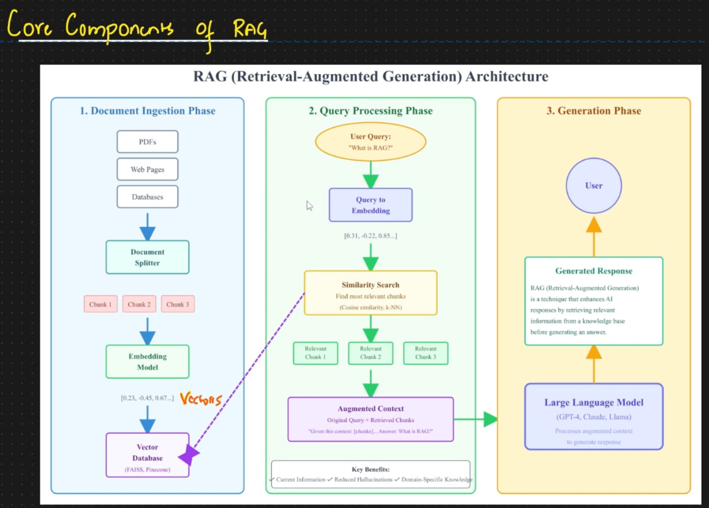
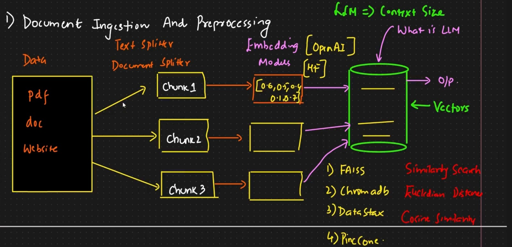
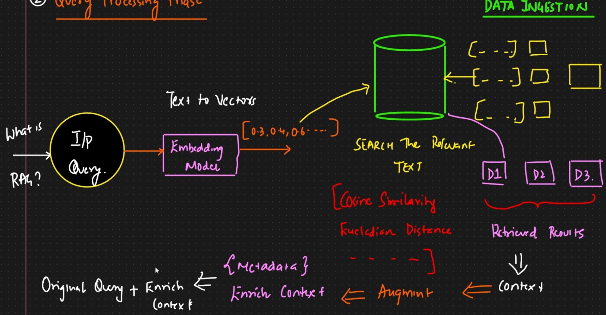
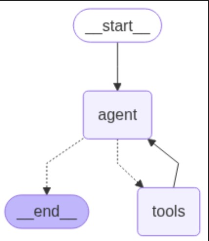
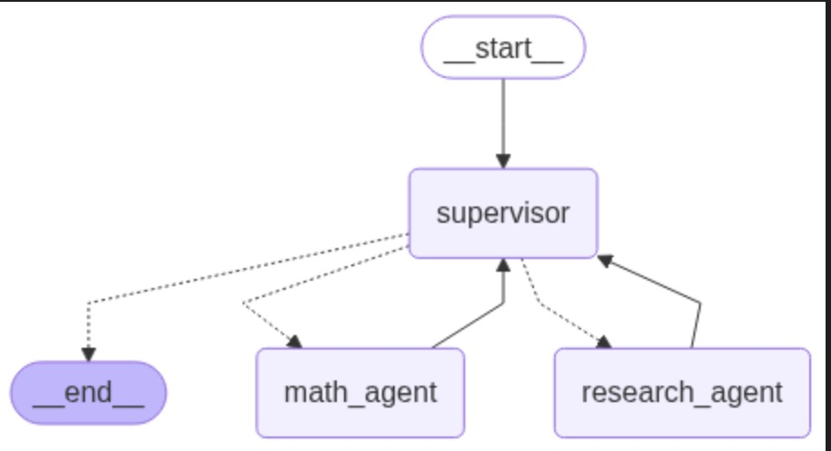
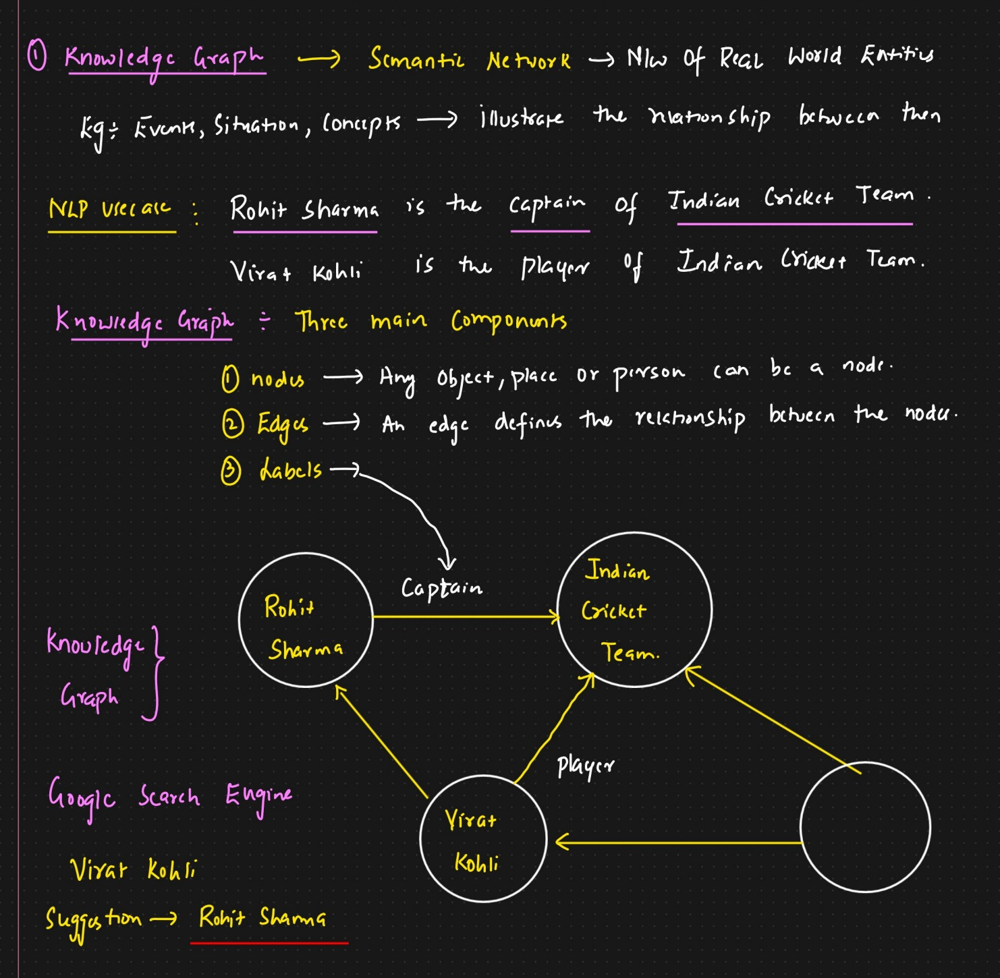

# AI Chatbot Architecture Notes

Reference guide for building RAG-enabled chatbots, agent workflows, and LangGraph automations.

---

## ReAct Architecture

**ReAct** stands for *Reasoning + Acting*. The model reasons about next steps, selects tools, executes actions, and iterates until the goal is satisfied.



---

## Retrieval-Augmented Generation (RAG)

### RAG basics

RAG supplements an LLM with external knowledge (documents, wikis, APIs, databases) that is retrieved at query time so answers stay accurate and grounded.


### RAG vs. other techniques

| Approach | Description | Pros | Cons |
|----------|-------------|------|------|
| **Prompt engineering** | Carefully crafted prompts only | Fast, no infra changes | Limited knowledge, brittle |
| **Fine-tuning** | Train on domain data | Great for tone/skills | Expensive, goes stale |
| **RAG** | Retrieve domain data on demand | Fresh facts, cite sources | Needs retriever + storage |

### Core building blocks

- **Retrieval**: pull candidate passages from knowledge sources
- **Augmentation**: attach metadata (source, timestamp, rank, etc.)
- **Generation**: feed the augmented context into the LLM for the final answer



---

## RAG workflow

1. **Document ingestion**
2. **Query processing**
3. **Generation**

### 1. Document ingestion & preprocessing

Prepare domain data so it can be retrieved efficiently.

- **Preprocess**: load, clean, chunk, embed, and persist vectors.
- **Store**: keep embeddings in a vector store/database for fast similarity search.
- **Query-time**: a retriever returns relevant chunks; the LLM consumes them.



#### Key ingestion steps

1. **Load the data**  
   Import from any source (text, Word, DBs, spreadsheets) and normalize into LangChain `Document` objects (`page_content` + `metadata`).

2. **Split the text**  
   Chunking is mandatory to stay within token limits, improve recall, reduce cost, and preserve meaning. Popular splitters:
   - Character splitter (fixed width)
   - Recursive splitter (paragraph → sentence → word hierarchy)
   - Token splitter (model-aware window)
   - Semantic splitter (meaning-based boundaries)

3. **Embed**  
   Embeddings map data into high-dimensional vectors that encode meaning. Use cases include semantic search, chatbots, recommendations, and anomaly detection. Example model: `sentence-transformers/all-MiniLM-L6-v2` (384 dims). Higher-dimensional models trade cost for accuracy.

4. **Store vectors**  
   - **Vector store**: lightweight (ChromaDB, FAISS, in-memory files) for quick prototyping.  
   - **Vector database**: production-grade services (Pinecone, Milvus, Weaviate, Qdrant) with indexing, filtering, and scaling.

### 2. Query processing



1. Convert the user query into an embedding.  
2. Compare it with stored vectors (cosine similarity, dot product, etc.).  
3. Retrieve the top chunks.  
4. Enrich the results with metadata, scores, and provenance.

#### Retrieval strategies

- **Similarity search** (default in `simple_rag.py`)
- **Hybrid search**: blend sparse (BM25/TF-IDF) + dense retrieval with tunable weights
- **LLM re-ranking**: hand top-k chunks to the LLM for reranking
- **Maximal Marginal Relevance (MMR)**: balances relevance with diversity, available via `search_type="mmr"` to avoid near-duplicate chunks

### 3. Query enhancement

Instead of sending the raw user query straight to the retriever, improve it first:

```
user query → [LLM + prompt] → refined query → retriever
```

- **Query expansion**: add synonyms, related terms, entities (e.g., kidney pain → renal pain, nephrology, flank pain).  
- **Query decomposition**: break complex questions into sub-queries, retrieve per sub-query, merge answers.  
- **HyDE (Hypothetical Document Embeddings)**: let the LLM draft a synthetic answer, embed that document, then retrieve against it (LangChain’s `HypotheticalDocumentRetriever` provides a ready-made flow).

### 4. Generation

The LLM receives the original query plus the retrieved context and generates an answer that is grounded in the provided evidence.

---

## Handling non-text content

### OCR (Optical Character Recognition)

OCR converts pixels to characters only—no layout or semantic understanding.

**Example**  
Invoice → OCR → `"Invoice No: 123, Amount: $450"`

**Limitations**  
- Raw text output only  
- No structure or context  
- Needs downstream parsing to add meaning

### Multimodal RAG

Uses multimodal models (GPT-4o, Gemini, Claude Vision, etc.) that understand text + images + diagrams natively.

**Workflow**
- Send the raw visual asset
- Model interprets layout, tables, charts, and text
- Retrieval + generation happens in a single multimodal loop
- No separate OCR stage required

**Best suited for**
- Reports, dashboards, and slide decks
- Forms, invoices, receipts
- Technical diagrams and tables

**Advantages over OCR**
- Retains layout and context
- Interprets visual elements
- Produces more accurate answers

---

# LangGraph Essentials

**Reference notebook:** `AIAgentWithrag.ipynb`

- **Node**: a Python callable
- **Edge**: transitions between nodes
- **State**: shared data passed between nodes
- **State graph**: the orchestrated workflow

## Memory management

LangGraph checkpoints state automatically. Persist it across sessions with `MemorySaver()`:

```python
memory = MemorySaver()
graph = graph_builder.compile(memory)
```

## Streaming options

Two APIs (`stream`, `astream`) and two payload types (`values`, `updates`).

```python
graph.stream({"messages": ""}, stream_mode="updates")
graph.stream({"messages": ""}, stream_mode="values")

graph.astream_events  # useful for debugging
```

---

## LangGraph + RAG (Agentic RAG)

Treat each retriever as a tool inside an agentic workflow.

**Handy helpers**
- `create_react_agent()` builds an LLM + tools stack quickly.
- `state.model_copy(update={"param": "new value"})` clones and mutates state immutably.
- `llm.with_structured_output(YourModel)` enforces JSON/typed responses.

### DEBUGGING GRAPH FLOW
   1. add and load following .env variables
   ```
   LANGSMITH_API_KEY = lsv2_pt_xxxxx
   LANGCHAIN_TRACING_V2=true
   LANGCHAIN_PROJEC
   ```
   2. add langraph.json file

   3. run in cmd
   langgraph dev
   it will launch the url in a tab
   
### Autonomous RAG loop

```
START → Planner / Query Decomposer
      → Retrieve (vector) / Retrieve (sparse) / Retrieve (API)
      → Aggregator
      → Generator
      → Self-reflection
        ├─ OK → END
        └─ REFINE → improve query → retrieve again
```

- **Chain-of-thought planning**: break big questions into sub-queries and solve each.  
- **Query planning & decomposition**: similar to CoT but tailored for retrieval.  
- **Self-reflection**: evaluate outputs; rerun the loop if the answer is weak.  
- **Iterative retrieval**: `User → Retrieve → Generate → Reflect → (loop)` until quality is acceptable.  
- **Answer synthesis**: aggregate evidence from multiple sources, deduplicate overlaps, and produce a consolidated response.

------
### Multi Agents

   Agents means, if the llm have tools(not a simple input=>oupt) that can be called as an agent. it's like divide and conquer, create agent for each task or domain and route the tasks to the correct expert.
   
   #### Single agent
   

   * Multi agent (more than one agent work)
   * Supervisor Multi Agent (supervisor Agent will take care the child agents)
   * Hierarichal Agents ( more then one supervior can be called as hierarichal agent)

   


------
#### Evaluation of RAG pipline/ Testing the RAG using langraph

   -- Chose which llm is best in producing the result.
   -- we need to test our rag app whether it produce correct output or not.
      
   #### Overview
   A typical RAG evaluation workflow consists of three main steps:

   1. Creating a dataset with questions and their expected answers
   2. Running your RAG application on those questions
   3. Using evaluators to measure how well your application performed, looking at factors like:
   - Answer relevance
   - Answer accuracy
   - Retrieval quality

   In simple, if you want to test your agentic application, this evaluation is really helpful. first we need to create the datasets (sample question and answers) and we can it with evaluators (ex: we can use llm as judge actual answer vs ai output) 

----

### Graph Database

   data will be stored in graph strutures, nodes,edges and labels.
   Neo4j is one of the popular graph data base.

   Use Neo4j only if: (ex: social media apps, Supply Chain & Logistics)
      Your data is heavily relational

      Queries involve multi-hop traversal

      You need paths, not just records

      Structure matters more than text

   Don’t use Neo4j when:
      Your data is mostly documents, JSON, or tables

      Retrieval is semantic, not relational

      The system is CRUD-heavy

      Relationships are shallow (1–2 levels)

   